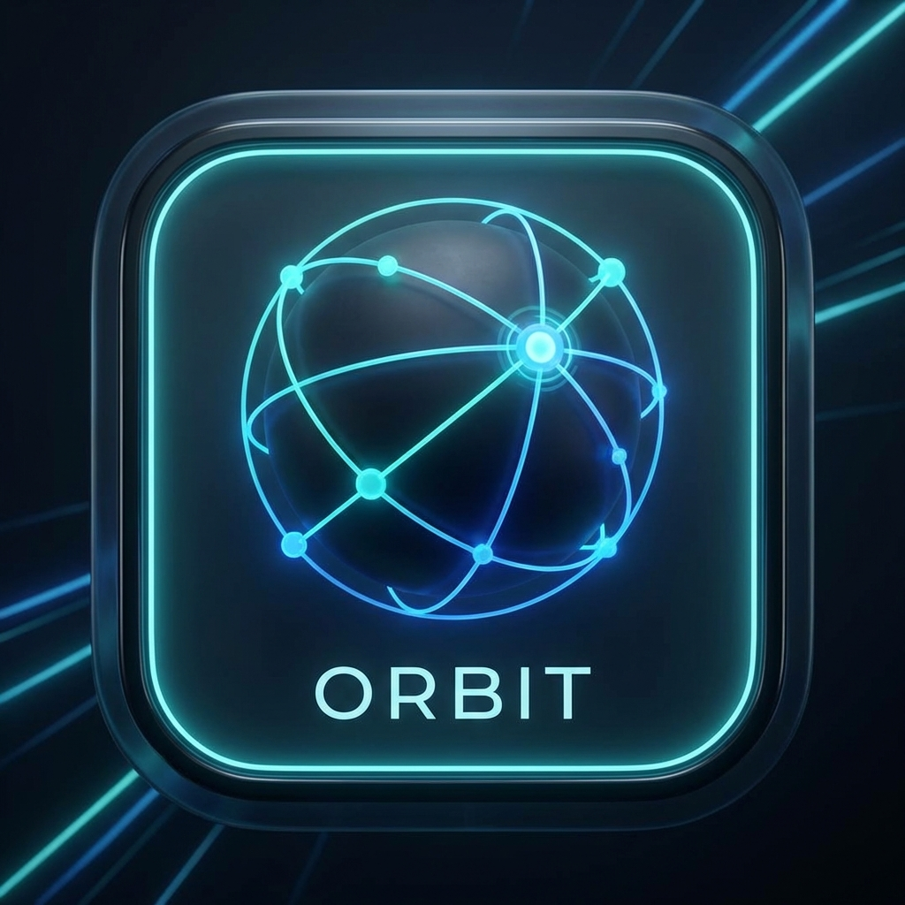
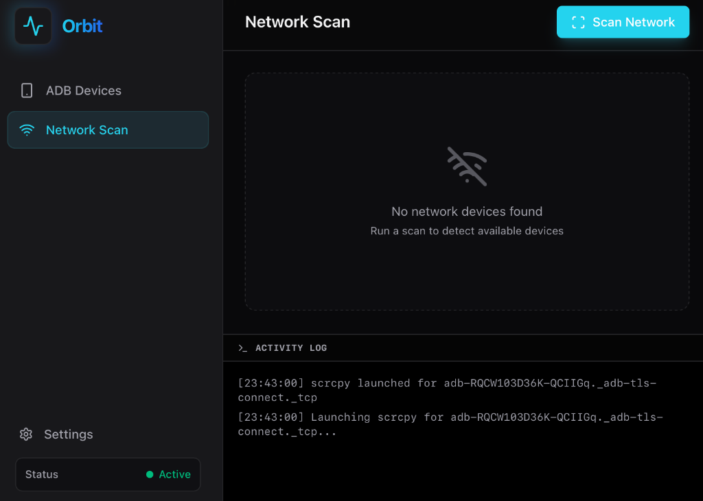
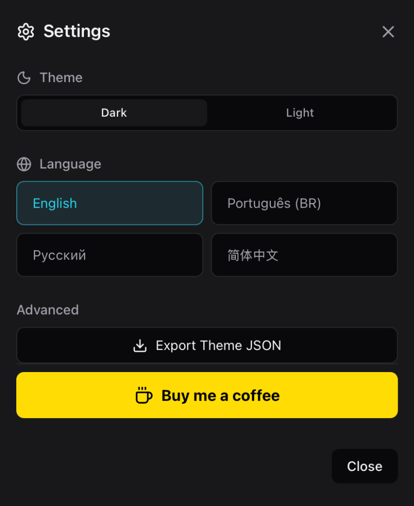

<div align="center">
  <h1>Orbit</h1>
  <p><strong>Futuristic Android Device Manager</strong></p> 
  
  <p>
    Struggling with ADB commands? Tired of searching for your device IP? <br/>
    Orbit makes connecting and managing Android devices seamless, fast, and beautiful.
  </p>

  [](https://www.buymeacoffee.com/maktheus)
</div>



**Orbit** is a high-performance desktop application that solves the pain of Android device management. Built with **Tauri**, **React**, and **Rust**, it eliminates the need for terminal commands by providing a premium, sci-fi inspired interface for network scanning, one-click wireless connections, and screen mirroring.

## ✨ Features

- **🌐 Network Scanner**: Automatically detect Android devices on your local network/subnet.
- **⚡ Rapid Connection**: Connect wirelessly via TCP/IP with a single click.
- **📱 Device Management**: View detailed device info (Model, Serial, State).
- **🖥️ Screen Mirroring**: Integrated `scrcpy` support for high-quality mirroring.
- **🌍 International**: Multi-language support (English, Português, Русский, 简体中文).
- **🎨 Modern UI**: Sleek dark mode interface inspired by sci-fi aesthetics with Light Mode support.

## 📸 Screenshots

| Dashboard | Network Scanner | Settings |
|:---:|:---:|:---:|
|  |  |  |

## 🛠️ Tech Stack

- **Frontend**: React (Vite), Tailwind CSS v4.
- **Backend**: Rust (Tauri), utilizing system `adb` and `nmap`.
- **Styling**: Custom "Orbit" Design System (Zinc + Cyan + Electric Blue).

## 🚀 Getting Started

### Prerequisites
- **Node.js** & **npm**
- **Rust** & **Cargo**
- **ADB** (Android Platform Tools)
- **Scrcpy** (`brew install scrcpy`)
- **Nmap** (Optional: `brew install nmap`)

### 📦 Installation

#### Homebrew (macOS)
```bash
brew tap maktheus/homebrew-tap
brew install --cask orbit
```

#### Manual
1. Download the latest `.dmg` from [Releases](https://github.com/maktheus/Orbit/releases).
2. Open and drag to Applications.

## 🌍 Languages

Change the language in **Settings** (Gear Icon):
- 🇺🇸 English
- 🇧🇷 Português (Brasil)
- 🇷🇺 Русский
- 🇨🇳 简体中文

---
*Built with code & stardust.*
